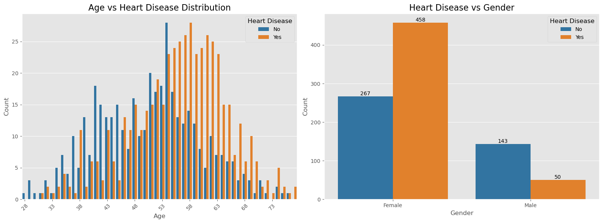
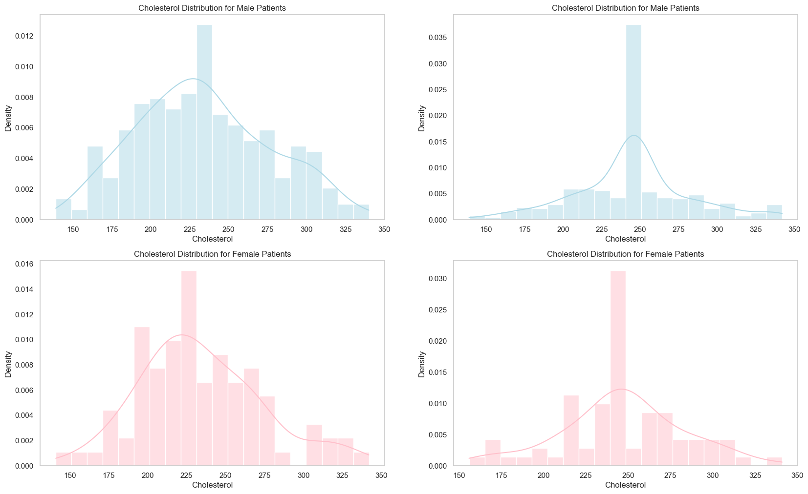
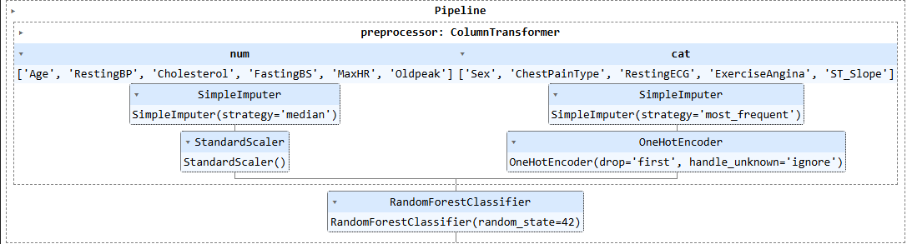

# Data Science Team 2 

# 🫀 Heart Disease Prediction Model
This project uses a combined heart disease dataset to develop a predictive model for diagnosing the presence of heart disease based on clinical features. A Random Forest Classifier is trained and evaluated for performance using accuracy, precision, recall, F1, Confusion Matrix. The results are further illustrated with data visualizations and analysis, supporting explainability and clinical insight.

## ✅ Purpose & Overview
The objective of this project is to:
- Develop a machine learning model for predicting heart disease.
- Identify significant predictors contributing to heart disease.
- Provide intuitive visualizations to support model interpretability for both technical and non-technical audiences.

A cleaned dataset combining five heart-related datasets serves as the input, and Random Forest Plot regression was chosen for data modeling. 

## Dataset Overview 
The final dataset contains 918 unique patient records drawn from five publicly available sources:

| Dataset             | Observations |
|---------------------|--------------|
| Cleveland           | 303          |
| Hungarian           | 294          |
| Switzerland         | 123          |
| Long Beach VA       | 200          |
| Stalog (Heart)      | 270          |

Source: [UCI Machine Learning Repository](https://archive.ics.uci.edu/ml/machine-learning-databases/heart-disease/)  
Citation: *fedesoriano*, [Heart Failure Prediction Dataset (Kaggle)](https://www.kaggle.com/fedesoriano/heart-failure-prediction)

## 📊 Key Variables & Feature Descriptions
| Column Name       | Description                                                                                  |
|-------------------|----------------------------------------------------------------------------------------------|
| Age               | Age of the patient (years)                                                                   |
| Sex               | Gender (1 = Male, 0 = Female)                                                                |
| ChestPainType     | One-hot encoded; Includes TA, ATA, NAP, and ASY (first category dropped)                     |
| RestingBP         | Resting blood pressure (mm Hg)                                                               |
| Cholesterol       | Serum cholesterol (mg/dl)                                                                    |
| FastingBS         | Fasting blood sugar > 120 mg/dl (1 = Yes, 0 = No)                                            |
| RestingECG        | Resting ECG results: 0 = Normal, 1 = ST Abnormality, 2 = LVH                                 |
| MaxHR             | Maximum heart rate achieved                                                                  |
| ExerciseAngina    | Exercise-induced angina (1 = Yes, 0 = No)                                                    |
| Oldpeak           | ST depression induced by exercise compared to rest                                           |
| ST_Slope          | Slope of the ST segment: 0 = Up, 1 = Flat, 2 = Down                                          |
| HeartDisease      | Target variable (1 = Heart Disease, 0 = Normal) 

## 🔍 Exploratory Data Analysis

### Key trends and insights:
- **Age**: Normally distributed across the population.  
- **Sex Distribution**: Majority male, indicating gender imbalance.  
- **Chest Pain Type**: Most common is 'ASY' (Asymptomatic).  
- **Feature Correlation**: Oldpeak and ST_Slope show notable associations with heart disease.

The figure contains two subplots analyzing the relationships between age, gender, and heart disease. The first subplot, **Age vs Heart Disease Distribution**, presents a histogram illustrating the counts of individuals with and without heart disease across different age groups. It shows that people without heart disease (blue bars) are fairly evenly distributed across ages, with some peaks around ages 48 and 55. In contrast, individuals with heart disease (orange bars) tend to be concentrated in the middle age range, particularly between ages 50 and 60, with a peak around age 55. This indicates that the occurrence of heart disease generally increases with age, especially in the 50-60 age bracket. The second subplot, **Heart Disease vs Gender**, highlights that males (represented by '1') have a significantly higher count of heart disease cases—458—compared to females, who have only 50 cases. Males without heart disease number 143, suggesting a higher prevalence of heart disease among males in this dataset. Overall, the data suggests that heart disease prevalence rises with age and is more common in males than females.

 

The top left plot displays the density and distribution of cholesterol levels for male patients, with the accompanying histogram illustrating the frequency of specific cholesterol values. In the top right plot, a similar density and histogram representation is provided for another subgroup of male patients, highlighting potential variations within this group. The bottom left plot shows the cholesterol distribution for female patients, with a pink-shaded histogram overlay indicating the spread of cholesterol levels within this group. Lastly, the bottom right plot presents the density and histogram of cholesterol levels for female patients, emphasizing differences compared to the male groups. The use of light blue and pink shades helps differentiate between the various patient groups or categories within the dataset.

! [Resting BP distribution by Gender and Patient Group](./figures/resting-bp-male-vs-female-mti.png)

The top left plot illustrates the distribution and density of resting blood pressure (measured in mm Hg) for male patients, with a histogram showing the frequency of specific blood pressure values. The overlaid density curve highlights the overall trend and spread within this group. The top right plot provides a similar visualization for another subgroup of male patients, revealing potential differences or similarities in blood pressure distribution compared to the first group. Moving to the bottom left plot, it depicts the blood pressure distribution for female patients, with a pink-shaded histogram emphasizing the range and frequency of values within this group. The bottom right plot presents the density and histogram of resting blood pressure for a different female subgroup, highlighting variations in blood pressure levels when compared to the other female group. The use of light blue shades in the male plots and pink shades in the female plots aids in distinguishing between the different patient categories.The observed differences in blood pressure distributions between male and female patients, as well as within subgroups of each gender, suggest underlying variations that may be influenced by demographic or health-related factors, warranting further investigation into their clinical significance.

### Additional Observations:

- Among males, the number of heart disease patients is higher than those without. Conversely, in the female population, there are more individuals without heart disease than with it.
- The presence of asymptomatic (ASY) chest pain is strongly associated with a higher likelihood of heart disease.
- Fasting blood sugar levels are not definitive indicators—patients with both elevated and normal fasting blood sugar levels show notable cases of heart disease.
- Resting ECG results do not provide a clear distinction; all three categories exhibit a substantial number of heart disease cases.
- The presence of exercise-induced angina significantly increases the probability of heart disease diagnosis.
- A flat ST_Slope slope is highly indicative of heart disease. A downward slope also correlates with heart disease, though it appears in fewer cases.

## 🧪 Model Development

The model selection process follows these steps: 

1. **Data Cleaning & Feature Encoding**: Categorical values are encoded using mapping and one-hot encoding.  
2. **Scaling**: Features are standardized using `StandardScaler` for model fitting.  
3. **Train-Test Split**: Data is split into train (80%) and test (20%) sets with stratification.  
4. **Model Training**: A `Random Forest` model is used in a `Pipeline`.  

  

The figure illustrates the pipeline for a Random Forest classification model. The pipeline begins with a preprocessing step using a ColumnTransformer, which comprises two main feature engineering components: a SimpleImputer with a median strategy, applied to handle missing values for numerical features such as 'Age', 'RestingBP', 'Cholesterol', etc., and another SimpleImputer with the most frequent strategy for categorical features like 'Sex', 'ChestPainType', 'RestingECG', etc. The imputed numerical data is then scaled using a StandardScaler to normalize the feature distributions. Subsequently, the processed features are fed into a OneHotEncoder for categorical variables, which handles transformation by creating binary dummy variables, with unknown categories ignored. Finally, the processed data is classified using a RandomForestClassifier, configured with a specified random_state to ensure reproducibility of results. 

## 📈 Model Evaluation

- **Confusion Matrix**:

  |               | Predicted 0 | Predicted 1 |
  |---------------|-------------|-------------|
  | Actual 0      |     69      |     13      |
  | Actual 1      |     11      |     91      |

  The confusion matrix provides a summary of the classification model's performance by comparing predicted labels against actual labels. 

Out of the actual negative cases (Actual 0), the model correctly predicted 69 as negative (Predicted 0), but incorrectly predicted 13 as positive (Predicted 1).
For the actual positive cases (Actual 1), the model correctly identified 91 as positive (Predicted 1), while misclassifying 11 as negative (Predicted 0).
Overall, the model correctly classified most instances, especially the positive cases, indicating good sensitivity. However, the false positives (13) and false negatives (11) highlight areas where the model could be improved for better accuracy.

- **Classification Report**:

| Metric    | Value |
|-----------|-------|
| Accuracy  | 0.870 |
| Precision | 0.875 |
| Recall    | 0.892 |
| F1 Score  | 0.883 |
| ROC AUC   | 0.931 |

This table displays the performance metrics of a Random Forest model, including Accuracy (0.870), Precision (0.875), Recall (0.892), F1 Score (0.883), and ROC AUC (0.931). 

The high Accuracy indicates that the model correctly predicts most instances overall. The Precision score suggests that when the model predicts a positive case, it is correct 87.5% of the time, minimizing false positives. The high Recall signifies that the model successfully identifies 89.2% of actual positive cases, reducing false negatives. The F1 Score, which balances Precision and Recall, is also high at 0.883, indicating strong overall predictive performance. Lastly, the ROC AUC of 0.931 reflects excellent discrimination between positive and negative cases, confirming the model's strong ability to differentiate between classes. Collectively, these scores suggest the model performs well in both identifying true positives and minimizing false predictions.

## 🧠 Data Visualization

Developed Visualizations:
- Bar graph visualization for basic statistical analysis   
- Heatmap showing correlations among features  
- Boxplots comparing key variables across disease status groups

https://github.com/anupgp/Heart-Failure-Prediction/tree/main/figures

## 🎨 Data Visualization Objectives

1. **Explore Data Distributions**  
   - Age, sex, chest pain by disease outcome

2. **Examine Feature Relationships**  
   - Boxplots  
   - Correlation analysis 

3. **Showcase Feature Importance**  
   - Bar chart of predictor significance  

## 🎯 Audience

This project is designed for:
- **Data scientists & analysts** in healthcare  
- **Medical researchers** and healthcare professionals  
- **Machine learning students**  
- **Anyone interested in clinical decision support tools

## 📚 Tech Stack & Libraries

| Library        | Purpose                                  |
|----------------|------------------------------------------|
| `pandas`       | Data manipulation                        |
| `numpy`        | Numerical computations                   |
| `seaborn`, `matplotlib` | Data visualization                 |
| `scikit-learn` | Modeling, evaluation, hyperparameter tuning |

## Ethical Considerations

- The dataset is anonymized, posing low privacy risks.  
- Ensure visualizations are inclusive (colorblind-friendly palettes, clear labeling).  
- Communicate model limitations and avoid overreliance in a real-world clinical setting.

## Future Enhancements

- Implement more complex models such as Random Forest or XGBoost for comparison.  
- Deploy a real-time prediction interface using Streamlit or Dash.  
- Perform feature selection or dimensionality reduction using PCA or Lasso.

## References

- **UCI Datasets**: https://archive.ics.uci.edu/ml/machine-learning-databases/heart-disease/  
- **Kaggle Dataset (Fedesoriano)**: https://www.kaggle.com/fedesoriano/heart-failure-prediction

## Links to Individual Recordings 

- Anup Pillai 
- Fatema Banihashem: https://drive.google.com/file/d/15tCy0BHCf7bzGrJJotcthEZ9cw2JETjJ/view?usp=drive_link 
- Mohd Tazim Ishraque: https://youtu.be/Dr4MyLWjdZQ 
- Khoren Avetisyan: https://youtu.be/B08OiPVSZCQ?si=qcTXIZXK503rFpyg 
- Khrystyna Platko: https://drive.google.com/file/d/1w0DnnJvaBip1ALvssbab3B6baqYcW73H/view?usp=sharing  
